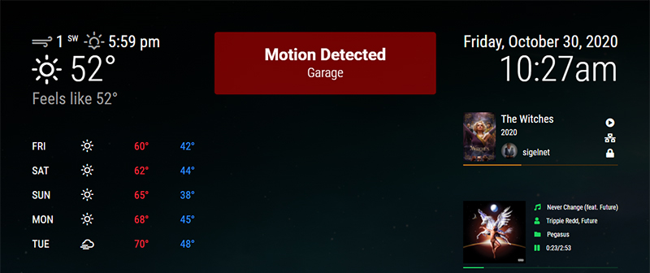

# MMM-MagicDash
Use your MagicMirror2 as a dashboard.

## Screenshots

Customized Alert Module with Sounds

## Modules Used
* [MMM-BackgroundSlideshow](https://github.com/darickc/MMM-BackgroundSlideshow)
* [MMM-iFrame](https://github.com/alberttwong/MMM-iFrame)
* [MMM-MyCalendar](https://github.com/jclarke0000/MMM-MyCalendar)
* [MMM-NowPlayingOnSpotify](https://github.com/raywo/MMM-NowPlayingOnSpotify)
* [MMM-PlexNowPlaying](https://github.com/glitch452/MMM-PlexNowPlaying)
* [MMM-Sounds2](https://github.com/sigel/MMM-Sounds2) _(Optional)_

## Custom CSS
The `css/custom.css` contains customizations such as removing module headers and changing the MyCalendar default layout.

## Config
The `config/config.js` contains my setup for each module.

_My collection of backgrounds used is available for download [here](https://drive.google.com/file/d/1pKJM75EsiSegkv3AJiF6Wgw1kcQ0xOI5/view?usp=sharing)_
