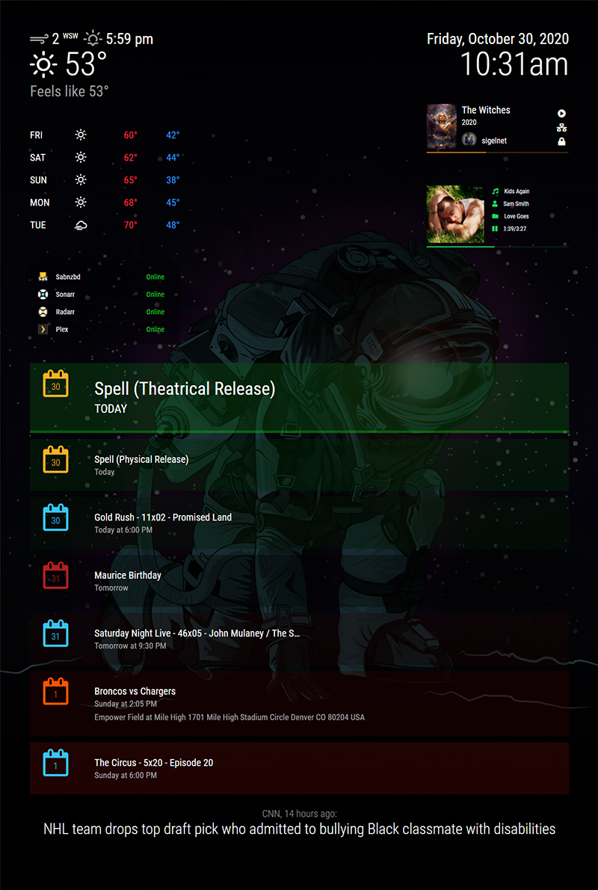

# MMM-MagicDash
Use your MagicMirror2 as a media dashboard with rotating backgrounds.

## Screenshots

Customized Alert Module with Sounds

## Modules Used
* [MMM-BackgroundSlideshow](https://github.com/darickc/MMM-BackgroundSlideshow)
* [MMM-iFrame](https://github.com/alberttwong/MMM-iFrame)
* [MMM-MyCalendar](https://github.com/jclarke0000/MMM-MyCalendar)
* [MMM-NowPlayingOnSpotify](https://github.com/raywo/MMM-NowPlayingOnSpotify)
* [MMM-PlexNowPlaying](https://github.com/glitch452/MMM-PlexNowPlaying)
* [MMM-Sounds2](https://github.com/sigel/MMM-Sounds2) _(Optional)_
* [MMM-Api](https://github.com/juzim/MMM-Api) _(Optional)_

## Custom CSS
The `css/custom.css` contains customizations such as removing module headers and changing the MyCalendar default layout.

## Config
The `config/config.js` contains my setup for each module.

_My collection of backgrounds used is available for download [here](https://drive.google.com/file/d/1pKJM75EsiSegkv3AJiF6Wgw1kcQ0xOI5/view?usp=sharing)_

### Status Page
If you want to use the widget showing online/offline status of services such as sabnzbd, plex, etc. You'll have to edit `status/index.php` and upload it all to a webserver and use the [MMM-iFrame](https://github.com/alberttwong/MMM-iFrame) module to show it on your dashboard.

As I wrote this, I decided it would be a fun idea to convert that to an actual module, so stay tuned!

### MMM-Api
I use this to send different alerts to my dashboard such as when motion is detected on certain cameras, when new shows and movies download etc. Some I do through ifttt.com and others have notifications built in.

_Example POST request: https://dash.url.com/api/v1/modules/alert/SHOW_ALERT?type=notification&title=Motion%20Detected&message=Front%20Door&timer=10000_
